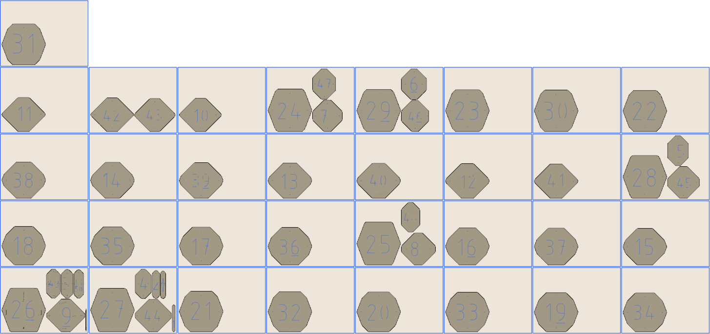

# SlicerImport
Fusion 360 Add-in to import the Slices created by Fusion Slicer.  It will create solid geometry based on the output DXF directory.

# Fusion Slicer
You can download Fusion Slicer from the [Fusion 360 App store](https://apps.autodesk.com/FUSION/en/Detail/Index?id=8699194120463301363&appLang=en&os=Mac)

Slicer for Autodesk® Fusion 360™ is a tool to turn your digital 3D models into appealing artefacts. It slices and converts 3D models into 2D patterns that you can cut out of any flat material. Slicer for Fusion 360 also creates 3D instructions you can interact with, to help build a model.
 
Create a model in Fusion 360 and with a few clicks you can send your model to Slicer for Fusion 360. Apply various slicing techniques to your model and create 2d plans in EPS, DXF or PDF formats that you can cut using Laser cutter or CNC machine.
 
Slicer for Fusion 360 can be used as standalone or as an add-in for Fusion, and lets you use different construction techniques to build your model based on 2D slices and animated assembly instructions. 
[Read Help Document](https://apps.autodesk.com/FUSION/en/Detail/HelpDoc?appId=8699194120463301363&appLang=en&os=Mac)

# Installation
[Click here to download the Add-in](https://github.com/tapnair/SlicerImport/releases/download/0.2/SlicerImport_0_2.zip)

_Note that due to submodules used in this project you need to use the above link to download, unless you are familiar with using terminal commands to pull github repos_

After downloading the zip file follow the [installation instructions here](https://tapnair.github.io/installation.html) for your particular OS version of Fusion 360 

# Usage
Documentation to come later. For now:
 - Launch Command
 - Select any file in the output directory from Slicer (_this will select the appropriate directory for you_)
 - Set the material thickness
 - Set the spacing between sheets

OR

 - Select "tight pack" to remove the frames created by slicer and attempt to push the parts closer together

